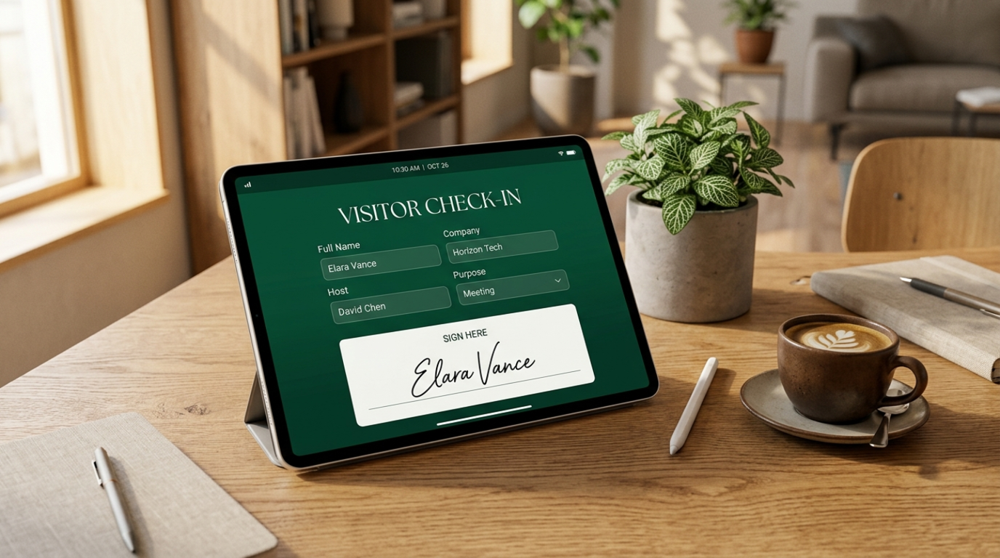

<div align="center">
  

  <h1>Simpel Resepsi Tamu Digital</h1>
  
  <p>
    <strong>Aplikasi Buku Tamu Digital Modern, Cepat, dan Aman dengan Fitur Tanda Tangan Digital.</strong><br>
    <em>Dibangun dengan Flutter untuk platform Android dan Windows Desktop.</em>
  </p>

  <p>
    
    
    
    
    
  </p>
</div>

---

## 📖 Tentang Aplikasi

**Simpel Resepsi Tamu Digital** adalah solusi modern untuk mencatat kehadiran tamu di instansi, kantor, atau acara. Menggantikan buku tamu fisik konvensional dengan sistem digital yang bersih, efisien, dan dilengkapi dengan kemampuan tanda tangan digital langsung di layar perangkat Anda. 

Aplikasi ini dapat beroperasi **sepenuhnya secara offline**, menyimpan data dengan aman secara lokal menggunakan SQLite, menjadikannya pilihan yang andal untuk berbagai kondisi operasional.

## ✨ Fitur Utama

*   📝 **Pencatatan Tamu Cepat**: Form input sederhana untuk Nama, Instansi, dan Keperluan (Rapat, Kunjungan, Pengiriman, dll).
*   ✍️ **Tanda Tangan Digital**: Canvas responsif untuk tamu membubuhkan tanda tangan langsung menggunakan sentuhan atau stylus.
*   🗂️ **Riwayat Kunjungan Terstruktur**: Data tamu dikelompokkan otomatis berdasarkan tanggal kunjungan (terbaru di atas).
*   🔍 **Pencarian & Filter Cerdas**: Cari tamu spesifik berdasarkan nama atau filter berdasarkan tanggal tertentu.
*   💾 **Penyimpanan Lokal yang Aman**: Semua data (termasuk gambar tanda tangan) disimpan dengan aman di penyimpanan perangkat (Offline Support).
*   📱💻 **Dukungan Multi-Platform**: Berjalan mulus di perangkat tablet/smartphone Android maupun PC Windows Desktop.

## 🛠️ Teknologi yang Digunakan

*   **Framework:** [Flutter](https://flutter.dev/) (Dart)
*   **Database:** `sqflite` (Android) & `sqflite_common_ffi` (Windows)
*   **Digital Signature:** Package `signature`
*   **Local Storage:** Package `path_provider`
*   **Date Formatting:** Package `intl`

---

## 🚀 Panduan Instalasi (Khusus Pemula & Non-Programmer)

Jika Anda **TIDAK memiliki latar belakang IT** dan hanya ingin menjalankan aplikasi *(source code)* ini di komputer/laptop Windows Anda, ikuti langkah-langkah mendetail di bawah ini dengan perlahan.

### 🛑 TAHAP 1: Persiapan Aplikasi Wajib (Lakukan Sekali Saja)
Karena aplikasi ini dibuat menggunakan teknologi **Flutter**, komputer Anda butuh dipasangkan "mesin"-nya terlebih dahulu agar aplikasinya bisa menyala.

1. **Install Git**
   - Kunjungi [git-scm.com](https://git-scm.com/) lalu klik tulisan Download for Windows.
   - Install seperti aplikasi biasa (Klik *Next* terus sampai selesai).
2. **Install Visual Studio (Sangat Penting)**
   - Kunjungi halaman [Visual Studio 2022](https://visualstudio.microsoft.com/downloads/).
   - Download versi **Community** (gratis).
   - Buka installernya, saat muncul layar pilihan dengan banyak kotak centang, Anda **WAJIB mencentang "Desktop development with C++"** (Pengembangan Desktop dengan C++).
   - Tunggu instalasi selesai (ukurannya lumayan besar, pastikan internet lancar).
3. **Install Flutter SDK**
   - Kunjungi [Halaman Download Flutter](https://docs.flutter.dev/get-started/install/windows).
   - Download file zip-nya, lalu ekstrak (unzip) foldernya ke lokasi yang aman (misal: `C:\flutter`).
   - **Langkah Terpenting:** Anda harus mengenalkan Flutter ke Windows. 
     - Buka menu *Start Windows*, ketik `Environment Variables`, dan tekan Enter.
     - Klik tombol **Environment Variables...** di kanan bawah.
     - Pada bagian *System variables* (kotak bawah), cari tulisan `Path`, lalu klik 2x.
     - Klik tombol `New`, lalu masukkan tulisan ini: `C:\flutter\bin` (sesuaikan dengan lokasi ekstrak Anda tadi).
     - Klik OK dan simpan semuanya.
   - *Cara mengecek:* Buka menu Start Windows, ketik **CMD**, tekan Enter. Ketikkan perintah `flutter doctor` dan Enter. Jika muncul banyak tulisan tanpa error merah bata, Anda telah berhasil!

### 📥 TAHAP 2: Mengambil Aplikasi Ini Ke Komputer Anda
1. Kembali ke halaman GitHub tempat aplikasi ini berada.
2. Cari tombol berwarna hijau bertuliskan **`<> Code`**.
3. Klik tombol tersebut, lalu pilih **`Download ZIP`**.
4. Ekstrak (unzip) file yang baru saja didownload tersebut ke dalam folder yang mudah dicari (Misalnya di folder *Documents*).

### 🎉 TAHAP 3: Menjalankan Aplikasi (Super Mudah)
Setelah Tahap 1 dan 2 selesai, untuk menjalankan aplikasinya Anda tidak perlu repot mengetik kode apa pun:
1. Buka folder hasil ekstrak pada Tahap 2 (Foldernya bernama `Simpel-Resepsi-Tamu-Digital`).
2. Cari file bernama **`start.bat`** *(mungkin di komputer Anda hanya terlihat bernama `start` dengan ikon kertas bergigi)*.
3. **Klik dua kali (Double-click)** file `start.bat` tersebut.
4. Layar hitam akan muncul. Jangan khawatir, biarkan saja! Skrip pintar ini sedang:
   - Membersihkan sisa-sisa file lama.
   - Mengunduh otomatis bahan-bahan pendukung.
   - Membangun dan membuka aplikasinya langsung di depan layar Anda.
5. Selamat! Aplikasi Resepsi Tamu Digital Anda siap digunakan.

---

## 🏗️ Untuk Programmer (CLI)
Bagi Anda yang terbiasa menggunakan terminal atau Command Prompt, Anda bisa menjalankan persiapan dan aplikasi secara otomatis hanya dengan mengetik perintah `start.bat`:

```bash
git clone https://github.com/username/Simpel-Resepsi-Tamu-Digital.git
cd Simpel-Resepsi-Tamu-Digital
.\start.bat
```

Atau jika Anda lebih suka menjalankan perintahnya satu per satu secara manual:
```bash
flutter pub get
flutter run -d windows
```

> 💡 **Tips Produksi:** Ingin menjadikan aplikasi ini siap dibagikan ke orang awam tanpa harus mereka menginstall Flutter? Cukup ketik perintah `flutter build windows`. Hasil jadinya *(file `.exe` beserta data pendukungnya)* akan muncul di dalam folder `build\windows\x64\runner\Release\`. Folder ini bisa langsung Anda kompres (zip) dan berikan ke siapa saja!

---

## 🎨 Identitas Desain
*   🟢 **Primary:** Deep emerald (`#0F6E56`)
*   🟡 **Secondary:** Warm gold (`#BA7517`)
*   ⚪ **Background:** Ivory cream (`#FAF9F5`)
*   ⬜ **Surface:** Putih (`#FFFFFF`)

<div align="center">
  Dibuat dengan ❤️ menggunakan Flutter.
</div>
